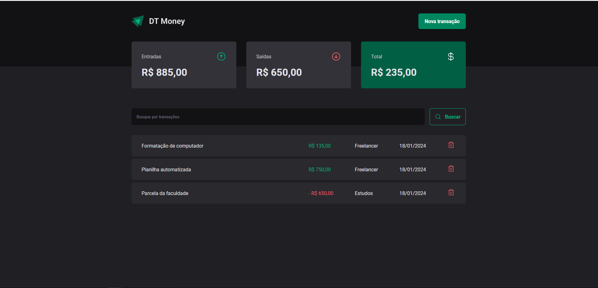
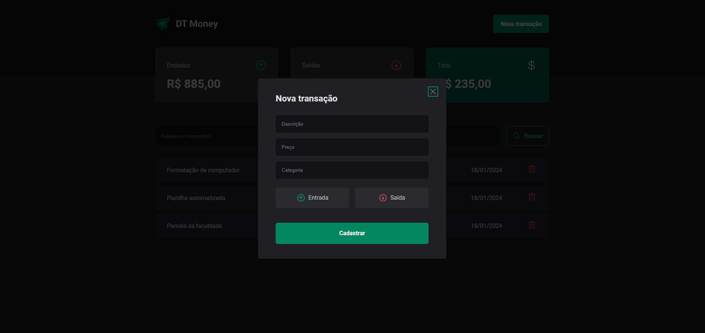

<h1 align="center">DT-MONEY 2.0</h1>

<h4 align="center">
  ☕ Gerencie suas finanças
</h4>

## 💻 Projeto
Projeto desenvolvido durante o treinamento de React (ignite) da plataforma de ensino Rocketseat.

## :rocket: Tecnologias

Tecnologias utilizadas no projeto:

- React
- JavaScript
- Html
- Css
- Styled Components
- Context
- Reducer

## 🤔 Como contribuir

- Faça um fork desse repositório;
- Cria uma branch com a sua feature: `git checkout -b minha-feature`;
- Faça commit das suas alterações: `git commit -m 'feat: Minha nova feature'`;
- Faça push para a sua branch: `git push origin minha-feature`.

Depois que o merge da sua pull request for feito, você pode deletar a sua branch.

---

Desenvolvido por [William José Dias!](https://github.com/WilliamWJD)
